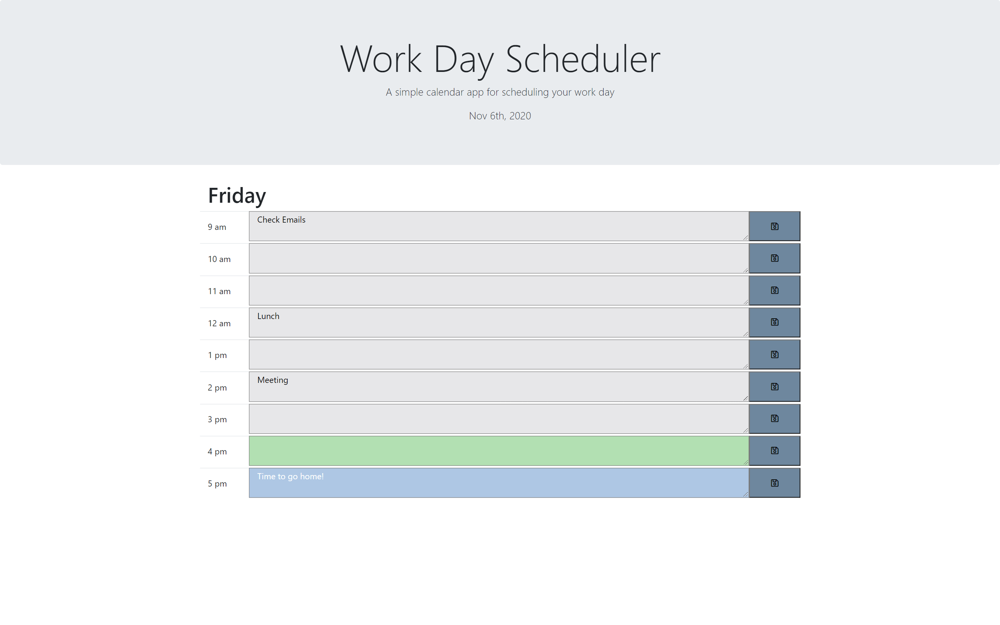

# Work_Day_Scheduler
# Description
Here is a daily planner for an average work day. This application features the moments.js API to capture real time so that the planner can be used on a daily basis. As real time passes, it will set the background color of each timeslot to indicate whether the time has past, or if it is the current hour, or whether the timeslot has not passed yet. You are also able to save your notes within each timeslot and come back to it later to review your agenda for the day. This project demonstrates some of my skill and knowledge in applying API's, JQuery, as well as Bootstrap for styling. Go ahead and save your lunch and meeting times with the use of this app!

## Table of Contents

* [License](#license)
* [Contributing](#contributing)
* [Screenshot](#screenshot)
* [Link](#link)
* [Questions](#questions)

## License

MIT

## Contributing

Ianaac27

# Screenshot
Here is a mock of the Work Day Scheduler.

# Link
Take a look at the live version [here.](https://ianaac27.github.io/Work_Day_Scheduler/)

## Questions

If you have any questions, please refer to my contact information below.

[GitHub: Ianaac27](https://www.github.com/Ianaac27)

Email: ian.fleshmancooper@gmail.com
